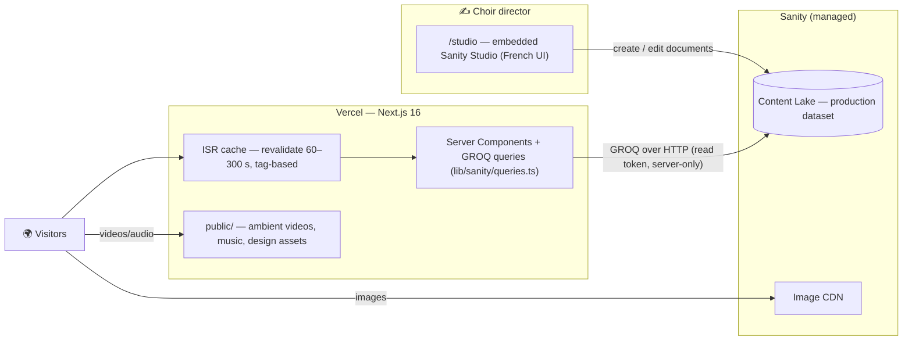

# ArtsParadise — Choir & Artist Website

Website for a choir and its director, **Michel Hilger** (violist, painter, organist and choir conductor): his artworks, biography, news, and the choir's activities. Rebuild of the legacy [artsparadise.net](https://artsparadise.net) site.

> 🚧 Work in progress — the public pages and the content model are live; parts of the choir section and the new artwork galleries are still being wired up.

**Stack:** Next.js 16 (App Router) · React 19 · TypeScript · Tailwind CSS 4 · Sanity CMS · Vercel

---

## Why these technical choices

### Sanity (headless CMS)

The single most important requirement: **the choir director publishes his own content — concerts, announcements, artworks, biography chapters — live, without touching code or asking a developer.**

- **Embedded Studio.** The Sanity Studio is mounted inside the Next.js app at `/studio`. One deployment, one URL: the director logs in on the website itself and edits in a visual interface, with the editing UI in French.
- **Structured content, not pages.** Content is modeled as ~20 typed documents (events, announcements, paintings, poems, songs, …), each with validation, instead of free-form HTML. The frontend decides how it looks; the editor only fills in fields — hard to break the design from the CMS.
- **Real-time collaboration & history** come for free (Sanity's document store), as does an **image CDN** (`cdn.sanity.io`) that resizes and serves editor-uploaded images.
- **Free tier** covers a small association's needs (3 users, generous API quota) — relevant for a non-profit choir.

*Alternatives considered:* WordPress (heavier hosting, the design would live in a theme the director could break), Git-based CMS like Decap (editing via commits is too technical), Strapi (needs a database + server to maintain; Sanity is fully managed).

### Next.js App Router + ISR

- **Server Components** fetch content with GROQ queries on the server — no client-side data fetching, no API keys in the browser, good SEO for a public showcase site.
- **Incremental Static Regeneration.** Pages are cached and revalidated every 60–300 s (`revalidate` per query in [lib/sanity/client.ts](lib/sanity/client.ts)). The director's edits go live within minutes **without a redeploy**, while visitors get static-page performance. Queries are also tagged (`tags: ["events"]`, …) so instant on-demand revalidation by webhook can be added later.
- **One repo, one deploy** on Vercel: site + studio + image pipeline. Push to `main` → deployed.

### Media strategy

Two kinds of media, two homes:

| Media | Where | Why |
|---|---|---|
| Editorial images (artworks, event photos) | Sanity asset CDN | Uploaded by the director in the Studio, resized/optimized by the CDN |
| Ambient design assets (background videos, music, page-hero films) | `public/` | Part of the design, not editable content; served by Vercel's CDN |

---

## System design



**Data flow:** the director edits documents in the Studio → they land in Sanity's Content Lake → server components re-fetch them at the next revalidation window → visitors see the update. No build step, no developer in the loop.

### Content model

Defined in [studio/sanity/schema.ts](studio/sanity/schema.ts), grouped by domain:

| Domain | Types | Notes |
|---|---|---|
| Œuvres (artworks) | `workCategory`, `painting`, `drawing`, `sculpture`, `appliedArt`, `poem`, `musicalWork` | One type per medium (they have different shapes: a poem is rich text, a musical work has audio/score). `workCategory` is a self-referencing 2-level taxonomy driving navigation; artworks reference categories, so cross-cutting rubrics (Portraits, Œuvres de jeunesse) need no extra types. |
| Biography | `biographyTopic`, `biographySubSection`, `book` | 15 chapters with rich text, inline images and sub-sections |
| News & communication | `announcement`, `pressItem`, `gallery` | Powers the gazette-style news page |
| Choir | `event`, `rehearsal`, `song`, `songCategory`, `choirMember`, `choirGroup` | Concert agenda & repertoire |
| Support | `donation` | The donors' fresco on the support page |
| Config | `siteSettings`, `page` | Hero texts, featured event |
| Shared objects | `captionedImage`, `purchaseLink`, `videoEmbed` | Reused across types |
| Legacy | `workSection`, `biographySection` | Kept under a "À migrer (ancien)" desk group until their data is fully migrated, then deleted |

The Studio desk structure ([studio/sanity/structure/index.ts](studio/sanity/structure/index.ts)) mirrors the old site's navigation exactly, so the director finds content where he expects it.

### Content migration

The legacy site's content (~500 artworks, 15 biography chapters, books, videos) was migrated with one-off TypeScript scripts that scraped the old Next.js site — parsing its React Server Component flight payload into Portable Text — and wrote to Sanity via `createIfNotExists` with deterministic IDs (idempotent, re-runnable, `--dry-run` support). The scripts were removed once the migration landed; they live in the git history (`git log --diff-filter=D --summary -- scripts/`).

---

## Pages

| Route | Content |
|---|---|
| `/` | Cinematic hero (video background, staggered title reveal), featured event, latest news |
| `/actuality` | Gazette-style news page from `announcement` documents |
| `/works` | Museum-style gallery: art wall, music palette, poetry reading panel (with audio or browser TTS, background music ducking) |
| `/biography`, `/biography/[slug]` | Chaptered biography from the CMS |
| `/communication`, `/partenariat` | Presentation pages |
| `/contact`, `/don` | Letter-style contact form, donors' fresco |
| `/choir`, `/events`, `/songs`, `/videos` | Choir section (in progress) |
| `/studio` | Embedded Sanity Studio (auth required) |

The site layout adds an ambient layer: background music player (original compositions) with an audio visualizer, a candle/sun light control, custom cursor, and page transitions — all client components wrapped around server-rendered content.

## Project structure

```
app/
  (site)/          # public pages (server components)
  studio/          # embedded Sanity Studio route
components/
  layout/          # nav, ambient audio/music system, page transitions
  ui/              # hero, galleries, video templates, rich text
lib/
  sanity/          # client, config, GROQ queries (all reads go through here)
studio/
  sanity/schemas/  # content model (one file per document type)
  sanity/structure/# desk structure mirroring the old site's navigation
public/            # ambient videos, music, design assets
```

## Getting started

```bash
npm install
cp .env.example .env.local   # then fill in the Sanity values
npm run dev                  # site + studio on http://localhost:3000
```

| Variable | Purpose |
|---|---|
| `NEXT_PUBLIC_SANITY_PROJECT_ID` | Sanity project (public — appears in asset URLs) |
| `NEXT_PUBLIC_SANITY_DATASET` | Dataset, `production` |
| `SANITY_API_TOKEN` | Server-only read token for GROQ queries |

## Roadmap

- [ ] Front-end consumption of the new artwork types (`painting`, `poem`, …) — the galleries still read the legacy `workSection` documents
- [ ] Migrate books & remaining legacy documents, then delete the legacy types
- [ ] Finish the choir section (`/choir`, `/events`, `/songs`)
- [ ] On-demand ISR revalidation via Sanity webhook (query tags are already in place)
